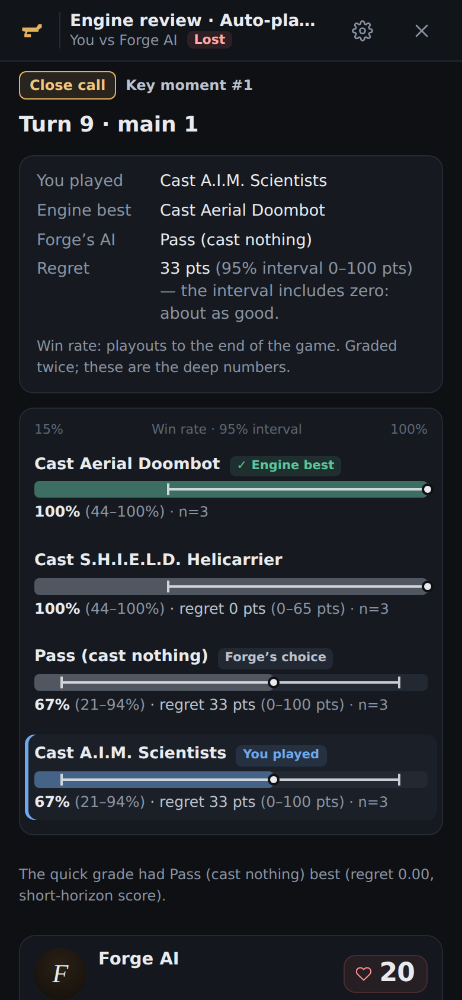

# ForgeCoach

**https://jalirkan.github.io/ForgeCoach/**

## Easiest way to start (Linux)

Open a terminal, paste this line and press Enter. You only do this once:

```bash
curl -fsSL https://jalirkan.github.io/ForgeCoach/forgecoach.sh | bash -s install
```

After that, **click ForgeCoach in your app menu**. It finds your mtg-table
folder (or downloads it), updates it, checks Java, Node, Forge and Claude Code,
starts the engine and opens ForgeCoach with Play already started. A small
window shows what it is doing; if something is missing it says what to install
and gives you the exact command to paste.

- **ForgeCoach (phone)** (also on right-click): play from your phone on the
  same Wi-Fi. It shows the link and a QR code, and sends the link to your
  phone with KDE Connect if you use it.
- **ForgeCoach (away from home)**: play from your phone on any network (mobile
  data, a cafe, work), over [Tailscale](https://tailscale.com), a free private
  network between your own devices. Set it up once with
  `forgecoach remote-setup` (see *Play away from home* below).
- **ForgeCoach overnight lab**: runs the cube lab's AI-vs-AI jobs unattended
  (see *Overnight lab on your PC* below).
- **Stop ForgeCoach**: stops the engine.
- No Forge yet? `~/.local/bin/forgecoach get-forge` downloads Forge 2.0.14
  from its official release into `~/forge` (the first start offers to do it).
- `forgecoach status` shows what is running and where everything is.
  `forgecoach help` lists the rest.

The launcher is [`public/forgecoach.sh`](public/forgecoach.sh). It never runs
`sudo` on its own (`remote-setup` runs one only after you answer yes at a
terminal prompt) and updates itself once a day.

ForgeCoach is a 2D client for playing *Magic: The Gathering* against the Forge
AI, with a coach beside the board. You play from the web page; the Forge engine
runs on your own computer via [mtg-table](https://github.com/jalirkan/mtg-table).
At any decision you can ask Claude for the play it would make, with the reason,
the heuristic and the trap to avoid, and after the game you get a short review.
The coach reads the engine's own state (what is tapped, what was cast, mana in
pool), and card text comes from Scryfall rather than memory.

Recorded games can be replayed and reviewed, and a game played elsewhere can be
watched live (see below). It is a static page: there is no ForgeCoach server,
and your API key, logs and deck guides stay in your browser.

## Play vs Forge

1. In an mtg-table checkout, start the engine:

   ```bash
   ./scripts/play.sh --engine-only
   ```

   Wait for `Engine ready on ws://127.0.0.1:8642/ws`. Match options come from
   `play.sh`: `--deck`, `--ai-deck`, `--ai-profile`, `--mirror`, `--seed`,
   `--games`.
2. Close any mtg-table board tab. Only one window can hold your seat.
3. Open ForgeCoach and click **Play vs Forge**. The engine address can be
   changed there if you use another port.

Browser notes, because the page is `https://` and the engine is on your machine:

- **Chrome / Edge** ask *"Allow jalirkan.github.io to access apps and services
  on this device?"* the first time. Allow it (site settings, *Local network
  access*).
- **Firefox** works; use `127.0.0.1`, not a LAN address.
- **Safari is not supported**; it blocks the connection. Use another browser, or
  run ForgeCoach locally (`npm run dev`).

mtg-table only accepts the connection from an allowed `Origin`
(`https://jalirkan.github.io` and `localhost` / `127.0.0.1` by default).

### Keyboard

Forge's own buttons and your clicks on highlighted cards do the rest; the
engine decides what is legal.

| Key | Does |
| --- | --- |
| Space / Enter | the highlighted (primary) button, usually OK / pass |
| Esc | the engine's Cancel button (End Turn, Alpha Strike, Cancel...) |
| P | pass priority once |
| E | pass until end of turn (Cancel stops it) |
| T | pass until my next turn |
| B | pass until just before my turn (opponent's end step) |
| A | attack with everything (while declaring attackers) |
| Ctrl+Z | undo the last mana tap |
| W U B R G C | spend one floating mana of that colour |
| ? | show this list in the game |

### The coach

The panel beside the board follows the current decision (main phases, attacks,
blocks, responses, engine questions). The coach can answer three ways:

- **Claude Code on your PC (no API key).** mtg-table's `./scripts/play.sh`
  also starts a small *coach helper* (`http://127.0.0.1:8643`) when the
  [Claude Code](https://claude.com/claude-code) CLI is installed and logged in
  on that machine. ForgeCoach finds it on its own; answers come from your
  Claude Code login and are marked *via Claude Code on your PC*. On a phone
  (the engine-served page, below) the helper is on the desktop's address,
  port 8643, and the page's pairing token goes along with each request.
- **Your own API key.** Paste an Anthropic API key in Settings. ForgeCoach
  sends the request straight to Anthropic; answers are marked *via API key*.
- **Copy prompt.** Nothing needed: copy the full prompt (state, card text,
  your deck guide) and paste it into the Claude app or claude.ai.

Settings → **Coach source** shows whether the helper is running and picks the
source: *Automatic* (the default: the helper when it is found, else your key),
*Claude Code* or *API key*. The model choice applies to both (Opus 5.5 → `opus`,
Sonnet 5.5 → `sonnet`, Haiku 4.5 → `haiku` for Claude Code). Either way the
coach gets the decision's state and the exact text of the cards involved, and a
switch asks automatically at your main phases, attacks and blocks.
For development, `?coach=http://127.0.0.1:<port>` points the page at a helper
on another port.

Claude Code answers one question at a time. With a current mtg-table (decision
D325) the helper **queues** the others: a second question (auto-coach at your
attacks while the main-phase answer is still coming, or an *Ask* during one)
shows *Waiting for the coach…* until its turn instead of failing. When the game
moves on to another decision, the play screen stops the question it no longer
needs (a waiting one leaves the queue; a running one stops Claude Code), and a
newer question from the same tab replaces an older one still in line. An older
helper without a queue still answers *busy* to a second question.

Settings → **Coach thinking** (*Default*, *Low*, *Off*) caps how long Claude
Code thinks before its first word (mtg-table decision D346; the helper sets
Claude Code's documented `MAX_THINKING_TOKENS` and `CLAUDE_CODE_EFFORT_LEVEL`
for that one answer). It matters most for Haiku, which otherwise thinks for
15–40 s before answering; Sonnet and Opus always think a little. It is sent only
to a helper that offers it, and the API key ignores it. While Claude Code has the
question and no word has come yet, the coach panel says *Claude Code is
thinking…* with the seconds so far.

Each answer shows the coach's **confidence** and the **rule** (heuristic) its
line follows, above the explanation. *Close call — think here* means the coach
sees another line about as good, or the right play turns on something hidden:
treat it as a moment to think, not a play to copy. Settings → **Answer first**
(off by default) asks the coach to start with the play in one line, so it shows
before the explanation has finished streaming.

A **deck guide**, your notes on how a deck wants to play, is written in the page
and included in every prompt for that deck.

### After the game

The game-over card offers **Review this game with the coach**: a turn-by-turn
summary and a review in the same style (what went well, at most three mistakes
each tied to a general rule). Same choice: Claude Code on your PC, your key, or
copy the prompt. **Next
game** continues a match.

## Play on your phone

On the desktop, in your mtg-table checkout, run `./scripts/play.sh --engine-only --lan`.
It prints an address like `http://192.168.1.20:8642/?token=...`; open that on
your phone (same Wi-Fi), or scan the QR code if one is shown. The bridge serves
ForgeCoach itself, so the seat socket is on the same origin and no
https-to-ws mixed content is involved. This is for your home network only (away
from home, see below). The token is the key to your seat: don't share the link or post screenshots of it.

## Play away from home (Tailscale)

The phone mode above only works on your home Wi-Fi. To play from anywhere, the
phone and the PC join a free Tailscale network (only devices logged in to your
own account can see each other; nothing is opened on your router).

**Once, on the PC** (a terminal; each step asks before it uses `sudo`):

```bash
forgecoach remote-setup
```

It installs Tailscale if it is missing (Tailscale's official installer,
`curl -fsSL https://tailscale.com/install.sh | sh`; it prints the command and
asks first), runs `sudo tailscale up` (it prints a web address: log in there),
and can run `sudo tailscale set --operator=$USER` so later commands need no
password. Safe to repeat.

**Once, on the phone:** install the Tailscale app (Google Play or App Store) and
log in with the same account as on the PC.

**Each time:** start **ForgeCoach (away from home)** from the app menu (or
`forgecoach remote`). It starts the engine like the phone mode, then shows a link
with the PC's Tailscale address (`http://100.x.y.z:8642/?token=...`), a QR code
and a page with both, and sends the link to your phone with KDE Connect when it
is connected. On the phone, with the Tailscale app on, open the link. If
Tailscale is not connected on the PC it says so, and the link only works at home.

**The PC has to stay on, awake and online while you are away.** While the engine
runs, `forgecoach remote` holds a `systemd-inhibit` lock so the PC does not
suspend by itself (it is released when you stop ForgeCoach; set
`FORGECOACH_NO_INHIBIT=1` to skip it). If it cannot, it tells you to turn off
sleep in System Settings > Power Management. Start it before you leave (or have
someone at home click it), and remember: closing a laptop lid may still suspend it.
The link carries a secret token: do not share it.

## Draft & build (paper cube drafts)

**Draft & build** on the start page is a deck assistant for two-player Grid
and Winston drafts of Justin's four cubes (Synergy, Modern-era, Vintage,
Pauper; the lists are in `public/cubes/`). Everything runs in the browser;
pools are saved in it (several at once).

- **Pool**: the whole cube as cards. Tap what you take (switch to *They took*
  for the opponent's picks, which sharpens the pick helper), search, filter by
  colour, or paste a list (counts, set codes and `.dck` lines are fine). The
  number on each card is its pick value for your pool.
- **Build**: the best 40, three distinct builds, each with a score breakdown
  (card quality, synergy, curve, weak cards, creature count, interaction,
  splash, archetype) and plain reasons ("Skullclamp + Young Pyromancer: +6%
  together", "cut X: off-theme 5-drop"). Every colour pair is tried, with a
  splash where the pool has fixing; 22–24 spells (Auto picks); lands from the
  cube lab or 17 (16 with a low curve); basics by pips, early drops weighted.
  Thin pools (no pair reaches 23 playables) also get 18-land and three-colour
  builds, flagged. Tap a card to swap it and watch the score move. Export as a
  text list or a Forge `.dck`.
- **Grid**: enter the nine cards; it calls the row or column, counting what
  the opponent can take after you. **Winston**: enter the pile; take or pass.
- **Ask the coach** (Build tab): the pool, the build, its score, the lab's
  numbers and every card's text go to the coach (Claude Code via the coach
  helper, or your API key) with a deckbuilding prompt. It explains and
  suggests swaps; it never edits the deck.

**Cube lab data.** Each cube ships with a `meta.json` from mtg-table's cube
lab (`tools/cubelab.sh`: Forge AIs drafting and playing the cube): card win
rates, archetypes, card pairs, land counts, splash results. Samples are small,
so everything weighs the lab by its games (a card's raw win rate counts
games ÷ (games + 80) against the page's own estimate; a card with no lab games
is the page's estimate alone; `src/cube/score.ts` says why 80). Import a newer
`meta.json` from the chip in the header (or drop it on the page); it is kept in
this browser. Without any meta the assistant works from card text, mana value
and the cube's themes.

**Play the deck vs Forge.** Download the `.dck`, save it in mtg-table's
`decks/` folder, start the engine with it —
`./scripts/play.sh --engine-only --deck decks/<name>.dck --mirror` (or
`--ai-deck decks/<other>.dck`) — and press **Play vs Forge**.

## Overnight lab on your PC

The metagame and deck-assistant numbers come from mtg-table's cube lab: Forge
AIs draft a cube against each other, build decks and play them. That uses your
PC's CPU, not tokens or a network. One command runs the whole queue unattended:

```bash
forgecoach overnight          # or: app menu > "ForgeCoach overnight lab"
```

It updates mtg-table first, then runs these **one after another** (never in
parallel; each is resumable, so run it again and it continues where it stopped):

1. **Omega evolve**: 8 generations x 1200 drafts that swap dead and dominant
   cards out of the Omega cube (about 3.8 hours on an 8-core PC).
2. **Meta runs** of seven cubes (`meta-synergy`, `meta-modern-era`, `meta-vintage`,
   `meta-pauper`, `meta-fair-fight`, `meta-peasant`, `meta-omega`): 2000 drafts
   each, then the report that writes `meta.json` (about 50 minutes each on an
   8-core PC). A cube file your mtg-table checkout lacks (an older one) is
   skipped with a note, not treated as a failure; `git pull` it and run again.
3. **Learned drafter**: synergy self-play, 4 iterations x 1000 drafts, head-to-head
   1000, deck head-to-head 500 (about 2 hours).

The sizes come from measurements: a draft with its best of three costs 8 to 10
seconds of one core, and the evolve step needs 865 or more drafts a generation
to have enough data. The launcher assumes 10 s a draft, then **measures your PC**
from the drafts' own timings after the first finished job, keeps the figure in
`~/.config/forgecoach/config` and uses it for the estimates (`--dry-run` says
"about X h at Y workers (measured on this PC: Z s/draft)").

Options:

- `--jobs N`: workers per job. Default: **physical cores - 1** (the lab is limited
  by cores, not hardware threads), at most one per 4 GB of RAM (a Forge JVM).
- `--only evolve,synergy,learn` (`meta` is all seven meta runs; or name cubes:
  `fair-fight`, `peasant`, `meta-omega`; plain `omega` still means the evolve
  step), `--hours N` (start no new job after N hours),
  `--dry-run` (print the plan and the exact commands), `--yes` (run even while the
  engine is up, at the lowest priority), `--redo`.
- Sizes: `--evolve-gens N`, `--evolve-drafts N`, `--meta-drafts N`,
  `--learn-iters N`, `--learn-drafts N`, `--learn-h2h N`, `--learn-deck-h2h N`
  (whole numbers, 1 or more). The output folders carry the sizes
  (`omega-overnight-g8-d1200`, `<cube>-overnight-n2000`,
  `synergy-overnight-i4-d1000-h1000-k500`), so a changed size starts a fresh
  folder and a finished job counts as done only for the sizes it was run with;
  the same sizes resume where they stopped.
- `--budget-hours H`: scale every job's draft counts so the whole queue fits about
  H hours at the measured speed. Proportions are kept; nothing goes below the
  minimums (evolve 865 a generation, meta 500, learn 300 / 400 / 200), and the
  resulting sizes are printed. Combine it with `--only` or the size flags (which
  then set the proportions).
- `--stop`: stop a running lab. It sends `TERM` to the launcher, which stops the
  running cubelab and releases the sleep lock. Use `TERM`
  (`kill -TERM <pid>`), not `INT`: a background job of a non-interactive shell
  ignores `INT`. `forgecoach status` shows the stop command.

Everything runs under `nice`, holds off sleep with `systemd-inhibit` and logs to
`~/.cache/forgecoach/overnight.log`; a desktop notification says when it is
done. `forgecoach status` shows the sizes, the running job and its progress.

**Where the results land**, in `~/.local/share/forgecoach/`: `meta/<cube>.meta.json`
for all seven cubes (also `reports/`), `omega/` (the evolved cube and its changelog) and
`learned/synergy/` (values, synergy pairs, summary). **To use them**, open the
[Metagame page](https://jalirkan.github.io/ForgeCoach/#meta) (it lists the same
seven cubes, including Fair Fight, Peasant and Omega), pick the cube and
click **Import from file** (or drop the file on the page); the deck assistant's
**Lab** chip takes the same files. Imports are kept in that browser only.

## Lab progress (`#lab`)

[`#lab`](https://jalirkan.github.io/ForgeCoach/#lab) shows what the PC lab's
runner is doing, sized for a phone: the running job(s) with a progress bar,
done / total, rate, ETA (local time and "in 2 h 10 min"), elapsed, workers and
errors; the queue with estimates; waiting jobs with their reasons; finished
jobs (done, failed, skipped) with their headline numbers, newest first; and the
machine's load, memory, swap, memory pressure and recent pressure events.

- **Source**: on the PC itself the page first reads the runner's own copy,
  `http://127.0.0.1:8645/public-status.json` (the same numbers-only file,
  fresh to the second; the runner answers the browser's Private Network Access
  preflight and allows only this site's origin), with an 800 ms timeout. Else it
  reads the copy the runner pushes to this repo's orphan `lab-status` branch,
  `https://raw.githubusercontent.com/jalirkan/ForgeCoach/lab-status/status.json`
  (with a cache-buster; pushed when its numbers change, at most once a minute,
  and at least every two minutes regardless). Which one answered is remembered for
  the browser session (`src/lab/source.ts`), so a phone does not wait on the PC
  at every refresh; the PC is tried again every five minutes, or at a manual
  Refresh after 30 s. `#lab?src=<http(s) URL>` reads another copy instead, e.g.
  the PC from a phone through `tailscale serve`
  (`#lab?src=https://<machine>.<tailnet>.ts.net/public-status.json`, mtg-table's
  `docs/guides/lab-runner.md`); `#lab?src=sample` shows the bundled
  `public/lab-sample.json` with its times moved to now.
- **Freshness**: "updated 12 s ago · from your PC" (or "· from GitHub", or the
  custom source's host), counted every second. It turns amber after 10 minutes
  without an update and red after 30 ("the runner may be down"). A failed
  refresh keeps the last good data, dimmed, with the reason.
- **RUNNING / IDLE**: the runner says which, and when idle since when and why
  (queue empty, blocked after J###, held, paused, memory backoff, needs a
  check); IDLE turns red after 10 minutes. Its heartbeat (the loop's last tick,
  published at least every two minutes) tells a quiet job from a dead runner:
  over five minutes old, the page warns.
- **Live numbers**: a running job's card shows workers in use / max and a grid
  of its own metrics as of the runner's last minute read (`live`, numbers only):
  memory, drafts, games, rates per hour, engine errors and their rate, timeouts,
  draws, recordings and recording errors, bridge share, turns per game, disk;
  the job's headline metrics first, any other key under its raw name. A cube-lab
  queue adds a bar per cube, drafts done of planned ("cube 1", … unless the job
  file says `public_cubes: yes`). Keys outside the metric shape, non-numbers and
  out-of-range values are dropped (`parseLive`, `parseCubes`).
- It refreshes every 15 s while reading the PC and every minute otherwise, only
  while the page is visible, and at once on **Refresh** (a spinner while it
  runs).
- The file's format is in mtg-table's `RUNNER-SPEC.md` ("status.json");
  `src/lab/status.ts` validates it: unknown fields are ignored, missing ones
  show as "—", every string is shown as plain text.

## AI ladder (`#lab/ladder`)

[`#lab/ladder`](https://jalirkan.github.io/ForgeCoach/#lab/ladder) (the
**AI ladder** tab of the Lab page) shows mtg-table's AI ladder: every AI player
(Forge's stock profiles, the sacrifice-outlet policy, the search AI and later
variants) on one Elo scale, with `forge-default` fixed at 1500.

- **Ratings**: one row per player with its rating, the gap to the anchor, its
  95% interval drawn as a bar on a shared axis (the dashed line is 1500), games
  and record, and the raw head-to-head against `forge-default` with Wilson's
  interval. Unrated players (no decisive game) and unavailable ones are listed
  apart.
- **Honest about the intervals**: ranks are ranges ("1–5": the ranks the
  intervals allow); the summary names only players whose interval clears the
  anchor's; tapping a player shades its interval and colours every other one
  green (clearly above), red (clearly below) or gold (not separated).
- **Head-to-head tests** (the latest SPRTs: who vs who, H1 / H0 /
  inconclusive, games and deals used), the **tuner** (dev-set runs, with the
  winner's-curse caveat) and the **league** (best, pool, promotions), when the
  file has them.
- **Source**: on the PC, the runner's `http://127.0.0.1:8645/public-ladder.json`
  first, as for `#lab`; else
  `https://raw.githubusercontent.com/jalirkan/ForgeCoach/lab-status/ladder.json`
  (cache-busted), which the runner publishes numbers-only next to
  `status.json`; `#lab/ladder?src=<http(s) URL>` reads another copy,
  `#lab/ladder?src=sample` the bundled `public/ladder-sample.json`. Amber after
  a day without a new report, red after three; it refreshes every five minutes.
- The format is mtg-table's `ladder.json` schema 1 (`docs/guides/ai-ladder.md`,
  `tools/ai-ladder/report.ts`). `src/lab/ladder.ts` validates it and lists in
  `LADDER_FIELDS` exactly the fields the page reads, so the runner's sanitised
  copy can publish only those.

## Replay and review a recorded game

mtg-table writes a log per game and seat at
`<mtg-table>/var/games/<gameId>/frames.jsonl` (`ls -t var/games | head -1` is
the latest). Games between two Forge AIs (`./scripts/spectate.sh`) are in
`var/spectate/<name>.jsonl`; with no choices of yours to review, the coach
covers every turn from the viewing seat's side.

On the load screen, pick one of the two bundled samples or upload a
`frames.jsonl` / `.jsonl.gz`. It is read in the browser and not uploaded.
You get your decisions with the board at that moment and what you did, and can
coach each one or run the whole-game **Review** as above.

### Engine review

**Engine review** (the replay's top bar, or the game-over card) shows
mtg-table's post-game grading (its `docs/game-review.md`): every decision you
made, played out by the engine once per option, with what each option was
worth, what you chose, what scored best and what Forge's own AI would have
done. Open a report file (`tools/coach-grade.sh review` writes one; drop it
anywhere on the screen), or press **Run engine review** when the coach helper
offers it (`/health` says `review: 1`) — it takes a few minutes and the screen
shows queued / running (with the stage) / done. The sample game ships with an
engine-made report: **Sample engine review** on the start page, or
`#sample=human-auto-42&review=1`.

The screen lists the decisions by turn with the key moments ranked, and for
each one the board at that moment (the replay board), the options as bars with
95% intervals, and the verdict: *Mistake — clear* only when the regret
interval excludes zero, *Close call* when it includes zero (*a tie* when the
regret is zero: as good as the engine's best within noise), *Best play*.
Numbers from a short-horizon grade (to the end of the turn, scored by an
evaluator) are labelled as such, never as win rates. The yardstick is the best
play against Forge's Default AI playing both seats. After a Draft vs AI match
the review sends the cube list and the AI picks you saw, so the engine draws
the opponent's hidden cards from the pool — never the AI's list; for other
games it plays them as basic lands, and the screen warns that the numbers
flatter you. **Coach: explain the key moments** asks the coach (helper or key,
or Copy prompt) to explain the engine's table — why the best option scores
better — without re-solving it.



## Live watch (optional)

Follows a game being played in mtg-table's own board, read-only, so the newest
decision is always on screen. Live watch uses mtg-table's observer socket,
`ws://127.0.0.1:8642/observe` (the default), which any number of clients may
join and which cannot send anything. It never touches the `/ws` seat socket
(taking it would lock out your board). Start mtg-table as usual, click **Live**
and **Connect**. It catches up from the cached state, streams every frame,
starts a new log for each game of a match, and reconnects with backoff. The same
browser notes apply (Chrome permission prompt, Safari unsupported).

Fallback if your mtg-table lacks `/observe`: serve the game directory over HTTP
with CORS from the mtg-table checkout once the game has started,

```bash
npx http-server "var/games/$(ls -t var/games | head -1)" -p 8650 --cors -c-1
```

and connect to `http://127.0.0.1:8650/frames.jsonl`. ForgeCoach polls once a
second and reads only new bytes. Each game of a match is a new file. Any
`http(s)://` URL is treated this way.

## Privacy

- Your **API key** is kept in this browser's localStorage and sent only to
  `api.anthropic.com`, directly from your browser. Nothing goes through a
  ForgeCoach server; there isn't one.
- **Game logs** are read locally and never uploaded. When you coach, the
  decision's state and card text go to Anthropic with your request — straight
  from the browser with your key, or through the coach helper and Claude Code
  on your own PC. Copy prompt sends nothing anywhere.
- **Card data and images** come from [Scryfall](https://scryfall.com), fetched
  by your browser and cached in it (IndexedDB).
- **Draft pools** and imported cube-lab files stay in this browser
  (localStorage, IndexedDB).
- The **Lab** page only downloads the runner's public status file (or the
  `src` you give it); it sends nothing.

## Development

```bash
npm ci
npm run dev         # http://localhost:5173/
npm run typecheck
npm test
npm run build       # dist/
```

Pushes to `main` deploy to GitHub Pages (`.github/workflows/pages.yml`); pull
requests and other branches run typecheck, tests and build
(`.github/workflows/ci.yml`).

### Coach benchmark

`bench/coach/` holds a fixed set of real decisions from recorded games, each
with the answers a strong player accepts, the clear blunders and a short
rationale. Run it before and after a change to the coach prompt
(`src/prompt.ts`) to see what the change did. Every case rebuilds the exact
prompt the app would send (`buildCoachPrompt`, from the viewing seat's redacted
view only). In bench mode one extra section is appended to the prompt; it lists
the legal choices and asks for a final `ANSWER: <choice>` line (or, with
`--prompt-format answer-first`, a first one). Normal prompts are unchanged. Scoring: acceptable answer +1, blunder −1, anything else 0
(another answer, or a missing or illegal `ANSWER:` line). Cases marked
`"confidence": "low"` are run but not scored. The report gives the score per
decision type (mulligan, play/draw, spell, attack, block, target, pass, choice)
and the latency.

**Running it on your PC.** The bench asks the same coach the app does: the
local coach helper (Claude Code on your PC, no key) or the Anthropic API with
your key.

1. Start ForgeCoach as usual (the `forgecoach` launcher, or
   `./scripts/play.sh --engine-only` in mtg-table). This also starts the coach
   helper on `http://127.0.0.1:8643` (unless you passed `--no-coach`). Claude
   Code must be installed and logged in.
2. In a ForgeCoach checkout: `npm ci` once, then

   ```bash
   npm run bench:coach -- --label before            # the current prompt
   # …edit src/prompt.ts…
   npm run bench:coach -- --label after
   npm run bench:coach -- --compare bench/coach/results/<…>-before.json bench/coach/results/<…>-after.json
   ```

   Each run writes `bench/coach/results/<time>-<label>.json` (every reply in
   full) and a `.md` summary. Reports are git-ignored; `git add -f` one to keep
   it as a baseline.

**Repeats, because the coach is stochastic.** One answer per case cannot tell
two prompts apart: 25 against 26 is noise. By default every case is asked
`--repeat 3` times (any N). Calls go one at a time against the coach helper
(it runs one Claude Code at a time; more in flight only wait in its queue) and
two at a time against the API (`--concurrency K` overrides; asking for more
than the helper advertises prints a warning). That is about 3x the calls of a
single pass, so a full run takes about three times as long.

```bash
npm run bench:coach -- --label before --repeat 3
npm run bench:coach -- --label after  --repeat 3
npm run bench:coach -- --compare bench/coach/results/<…>-before.json bench/coach/results/<…>-after.json
```

How to read a run: the quality score is the mean over cases of each case's mean
answer score (acceptable +1, blunder −1, other legal answer 0), with a 95%
interval from a bootstrap over cases, so repeats of one case are never counted
as independent evidence. Missing, unparsable and illegal answers are format
failures: the coach answered, badly. They are reported separately (with a
Wilson interval) and left out of the score. A call that got no answer at all —
the helper busy, a usage or rate limit, an overload, a network or server error
— is first **retried with backoff** (busy, rate-limited and overloaded calls up
to 4 times, network and 5xx errors twice); only a call that still fails is a
**transport error**. Transport errors are counted apart from both, and a run
with any prints a loud *TRANSPORT ERRORS* warning at the top of its report,
exits with status 3, and makes any comparison with it untrustworthy: fix the
cause and run again. Each case also shows the answers seen and its agreement,
the share equal to its most common answer (transport errors left out); below
0.67 it is "unstable".

Latency is per answer, per type, without time spent in the helper's queue or
between retries. The report also has a **calibration** table — the mean score
of the answers the coach called high, medium and low confidence, with counts —
which says plainly when there is too little data to tell (a level needs 10+
answers from 4+ cases), and a **prompt size by section** table (system prompt,
card text, each player's state, …) showing where the characters go. Nothing is
trimmed; it is there to pick a target.

How to read `--compare a.json b.json` (A is the baseline, B the change): it is
paired over the cases both runs share, using each case's difference in mean
score.

- The verdict line says "B is better", "B is worse" or "no detectable
  difference". It calls a difference only when the 95% interval of the mean
  difference (paired bootstrap over cases) excludes zero, and needs at least 5
  paired cases. Treat "no detectable difference" as "not shown", not as "equal".
- The total difference (sum over cases) and its interval, the cases better /
  worse, and an exact sign test are printed with it.
- A **flip** is listed only when every valid answer of one run beats every valid
  answer of the other (2+ answers each). A case whose mean moved but whose
  answers overlap is in the difference table, not the flips.
- **Unstable** cases (agreement below 0.67 in either run) are listed; their
  differences mean little.
- Format failure rates and transport errors are compared separately from the
  score. A run with transport errors puts a warning above the verdict and the
  verdict is marked not trustworthy (the CLI exits with status 3).
- **Regret, when the cases are graded.** Graded cases carry a regret table (see
  *Engine-graded regret* below) and every answer to them a `regret` (value and
  interval). Once both runs have it, mean regret (lower is better) is the
  headline and the verdict, the pass rate becomes the secondary view, and the
  calibration table reads regret instead of the score.
- Result files from before repeats existed (one answer per case) still load, as
  N=1 with a warning; their cases cannot be checked for noise, so no flips are
  flagged against them.

Options: `--source helper|api` (by default the helper if it is up, otherwise the
API when `ANTHROPIC_API_KEY` is set), `--model <m>` (an alias the helper
accepts, or an API model id from `src/claude.ts`), `--only id1,id2`,
`--type block`, `--helper-url <url>`, `--repeat N`, `--concurrency K`,
`--model-by-type mulligan=claude-haiku-4-5,play_draw=claude-haiku-4-5` (a model
per decision type, ids from `src/claude.ts`; the helper gets the family alias,
`haiku`, `sonnet` or `opus`), `--prompt-format classic|answer-first`,
`--thinking off|low|default` (the helper only, and sent only when its `/health`
offers it, mtg-table D346; the report header and `--compare` show it). A full
run is 28 cases × N answers. Ctrl-C stops after the calls in flight and still
writes the report (every case then has at least one answer first, as passes go
over all cases in turn).

`npm run bench:coach -- --dry-run` builds every prompt and checks every case
without calling a model. Add `--show <case-id>` to print that case's full
prompt. The same checks run in CI as part of `npm test`
(`src/bench/coachBench.test.ts`): every case builds, every listed answer is a
legal choice at that moment, and card text is there for every card.

**Adding a case from one of your games.** mtg-table writes every game to
`var/games/<gameId>/frames.jsonl`.

```bash
npm run bench:coach -- list --log ~/mtg-table/var/games/<gameId>/frames.jsonl          # replay decisions
npm run bench:coach -- list --log ~/mtg-table/var/games/<gameId>/frames.jsonl --live   # every moment you acted
npm run bench:coach -- add --log ~/mtg-table/var/games/<gameId>/frames.jsonl \
  --decision 12 --type block --id block-my-game-double-block                         # or: --frame 1234 --live
```

`add` copies the log (gzipped) into `bench/coach/logs/`, fetches any missing
card text into `bench/coach/cards.json`, writes
`bench/coach/cases/<id>.json` and prints the legal choices. Fill in
`acceptable` (1–3), `unacceptable` (clear blunders) and `rationale`, then run
`--dry-run --show <id>` until it passes. `--decision n` picks the n-th replay
decision (the review screen's list, with the state at the start of that
decision). `--frame n --live` picks the moment just before your act or answer
at frame n, as the play screen's coach saw it. Use that for a target or an
engine question. Choose decisions whose right answer is clear to a strong player
from what you could see. Check the card text in the printed prompt, not your
memory. If you are unsure, use `"confidence": "low"`.

#### Engine-graded regret

Each graded case carries a **regret table** (`grade` in its JSON), made by
mtg-table's coach grader (`tools/coach-grade.sh`, its D334–D336): the decision is
rebuilt in Forge from the viewer's redacted view, the hidden cards (the
opponent's hand, the library order) are redealt from the opponent's deck list or
card pool minus what was seen — never the real ones — and every legal option is
played out a few hundred times by Forge's Default AI on both seats, to the end of
the game, on common random numbers (the same deals for every option, so option
differences are paired). Each option gets a win rate and a **regret**: the best
option's win rate minus its own, in win-rate points (0 = the best line), with a
95% interval. A bench run needs no engine: it maps the coach's parsed answer to
the table's option (identical creatures are interchangeable, as for the answer
lists) and records that option's regret.

- **The yardstick is "best against Forge Default".** That is the opponent
  ForgeCoach seats, it is fixed and reproducible, and no perfect-play oracle
  exists for Magic. Its limits: it rewards exploiting Forge's habits, can call a
  line that is right against a strong human wrong, and plays the rest of the game
  with Forge, not with you. The rebuild also loses history (until-end-of-turn
  effects, hidden exile); each table lists what its rebuild could not reproduce
  (`fidelity`).
- **Noise is reported next to every number.** A table has a `noise` (the median
  regret half-width; about ±3–5 points at 200 playouts per option); each answer
  keeps its option's interval; the report prints the mean grading noise beside
  mean regret, and per case.
- **Low information.** An answer whose regret interval is wider than ±0.08 is
  counted as low-information; the report says how many and gives mean regret
  without them. Format failures (missing, unparsable, illegal answers) have no
  regret and stay apart from quality; a legal answer the table has no option for
  is counted as "not in table".
- **Held-out cases.** About ten graded cases are held out (`"holdout": true`). A
  plain run skips them (`--split dev`, the default); `--split holdout` runs only
  them, to confirm a finished prompt change. **Never tune the prompt on what the
  held-out cases show.**
- **Calibration** reads regret: do answers the coach calls high confidence lose
  less than the ones it calls low?

Commands (the grading itself runs in mtg-table, on a PC):

```bash
npm run bench:coach -- moments --cases --out m.jsonl        # the bench's spell/attack/block/target cases
#   …mtg-table: tools/coach-grade.sh batch --moments m.jsonl --out graded.jsonl --jobs 6
npm run bench:coach -- import-graded graded.jsonl --write --holdout 10   # tables into the cases
npm run bench:coach -- regrade bench/coach/results/<run>.json           # regret for an older run
```

The opponent deck of each bench log is in `bench/coach/opponents.json`.
`--write` adds each table to the case with that id. Grading the bench is not a
routine step: the grader's main use is the live engine analysis a coach
explains (mtg-table D336).

### End-to-end test (play a whole game)

`e2e/play.e2e.mjs` opens the real app in a browser, joins the real Forge
engine's seat and plays one game to the end using only what a player sees:
it answers the opening dialogs and Forge's questions with their default
button, plays the hand cards the board outlines as playable (lands first),
pays with Auto, sometimes attacks with everything, and otherwise presses the
action bar's primary button. It fails on a stall (nothing on screen changes
for `STALL_SECONDS`, default 90), on any page error or console error, or when
it cannot join the table, and saves a screenshot and the console log to
`e2e/out/`.

```bash
# in mtg-table, in another terminal
./scripts/play.sh --engine-only
# here
npm run e2e                                    # desktop viewport
VIEWPORT=phone npm run e2e                     # a phone-sized, touch viewport
HEADLESS=0 MAX_TURNS=10 npm run e2e            # watch it, stop after round 10
```

Other settings: `SEAT_URL` (default `ws://127.0.0.1:8642/ws`), `APP_URL` (an
already-running ForgeCoach; by default the test starts vite on a free port of
127.0.0.1), `SEED`, `NEXT_GAME=0` (by default it starts the next game at the
end, because mtg-table ends its session when the client leaves at a game's
result) and `BROWSER_PATH`. It needs `playwright-core` with a Chromium, which
are deliberately not project dependencies: `npm install --no-save
playwright-core && npx playwright-core install chromium` once. The test is
not part of `npm test` and does not run in CI, since it needs mtg-table (a
private repository) and Forge (large) on the machine.

### Engine review screen test

`e2e/review.e2e.mjs` needs no engine: it builds the site, opens the sample
engine review at phone width (390 px) and desktop width, checks the timeline,
the bars, the board, the coach action and the verdict wording, asserts the page
never scrolls sideways, and saves screenshots (`OUT=docs/screens` for the
README's).

```bash
node e2e/review.e2e.mjs            # BUILD=0 to reuse dist/, HEADLESS=0 to watch
```

## Licence

GPL-3.0-or-later — see `LICENSE`. `src/protocol.ts` is copied from mtg-table
(GPL-3.0-or-later). Third-party credits and the Wizards of the Coast Fan Content
notice are in `NOTICE`.
